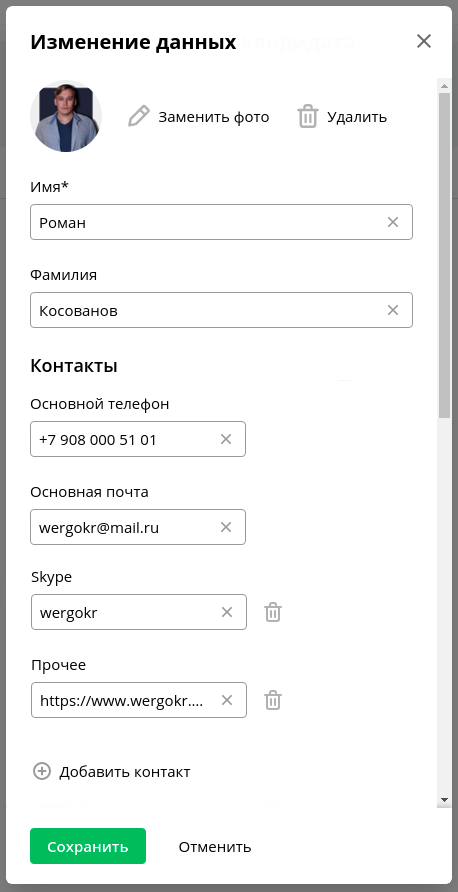
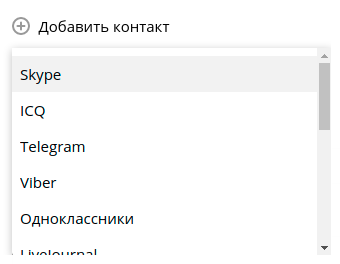

# Тестовое задание для QA Engineer

###Вводные данные: 
Страница контактов пользователя, доступная как через web браузер,
так и из гибридного мобильного приложения для Android и iOS.
```tpl
Frontend - Nuxt JS / Backend - Symfony / DataBase - MySQL.
```
Внешний вид и функциональные особенности представлены на рисунках ниже.
###Дополнительный критерий: 
Текст статуса и цвет подгружается на страницу из стороннего web-сервиса.

##Задачи:
1. Составить и правильно оформить следующие тестовые артефакты:
тест-план, чек-листы и тест-кейсы
######(при большом объеме работ, можно сократить перечень артефактов только до самых важных(критических!) примеров).
2. Предположить и составить список самых на Ваш взгляд критичных bug'ов.
   На один из bug'ов составить bugreport.
3. Описать процесс тестирования frontend и backend страницы по отдельности.
   Составить перечень программ используемых при данном тестировании.
4. Предположить список самых критичных трудностей с которыми можно
   столкнуться при тестировании страницы на мобильных устройствах.
5. Предположить и описать процесс автоматизации тестирования данной страницы.
   Составить перечень framework'ов используемых при автоматизации тестирования.

######Если для выполнения задачи не хватает каких-либо вводных данных, Вы можете самостоятельно предположить как работает тот или иной функционал.


Внешний вид страницы с контактами пользователя



Интерфейс редактирования данных на странице при нажатии на кнопку “Карандашик”



Выпадающий список при нажатии на кнопку “Добавить контакт”
